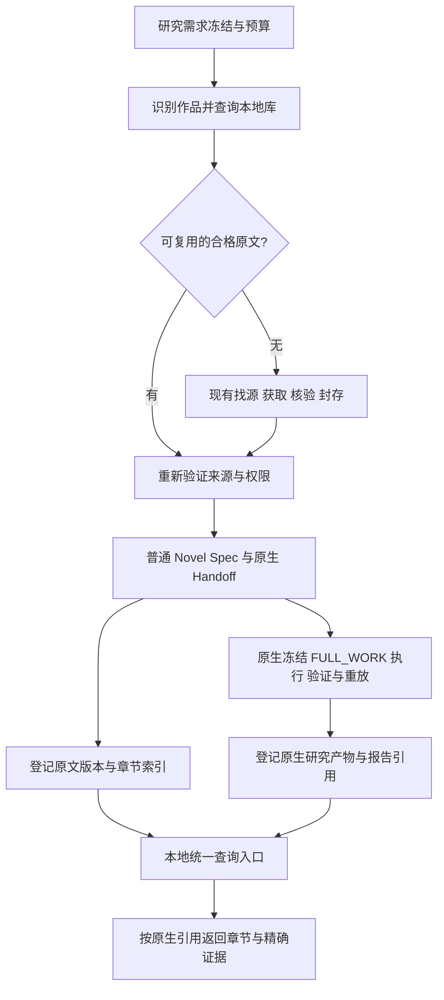

# 本地原文库与研究产物管理设计 v1

- 日期：2026-09-05。
- 状态：**设计完成，待实施**。本文的 library 命令、索引和自动接入点尚未实现。
- 核对基线：`104f0028116d29deb29b78adb64e8f94700d0707`（已包含原文获取及研究流程接入）。
- 实施阶段与验收：[LOCAL_RESEARCH_LIBRARY_PLAN.md](LOCAL_RESEARCH_LIBRARY_PLAN.md)。
- 既有执行流程：[SOURCE_ACQUISITION_WORKFLOW.md](SOURCE_ACQUISITION_WORKFLOW.md)。

## 1. 已确定的产品行为

用户提出研究需求后，宿主先冻结需求、研究范围和预算，识别作品，再查本地库。
有适用的合格原文就复用，没有则按现有流程找源、获取、核验、封存。
后续依旧通过原生 Handoff 和 Evidence Compiler 生成产物，最终登记到同一个库。
下一次研究同一本书时可以复用原文；已有研究结果先作为历史成果返回，是否能
回答新问题必须另行判断，不能因为书名相同就跳过执行。

**原文按逻辑章节保存，直接用于研究、跨章节检索和证据回查。** 统一管理靠作品、
版本和章节索引实现；本方案不生成整本 TXT，不提供整本拼接或整本导出功能。
最初取得的 TXT/EPUB 等原始输入仍作为 provenance 保留，不能因调整管理设计而删除。

| 对象 | 用户能做什么 | 权威来源 |
| --- | --- | --- |
| 作品 | 按书名、作者、别名查书，查看所有来源版本 | 原生 WorkRef 身份；别名只用于查找 |
| 原文版本 | 查看和检索章节、检查完整性和版本差异 | 已封存来源及其原始材料、目录和审查依据 |
| 研究记录 | 查看某个需求使用的版本、Profile、执行进度和失败原因 | 原生需求、Handoff、执行事件和回执 |
| 研究产物 | 查场景候选、观察记录和报告，返回原文核对 | 原生 Catalog/CAS、corpus、export 与报告依据 |

一个作品有多个原文版本，一个版本可用于多次研究，一次研究可以覆盖多部作品。
没有“每本书唯一最新结果”这种覆盖关系。连载新增、修订或切换镜像形成新版本，
旧版本和旧研究保留。当前完整全书准入规则不变，连载更新快照不冒充 COMPLETE。

## 2. 当前能力与缺口

以下是代码核对结果，不是待实现功能的声明：

| 当前代码 | 已有行为 | 本设计补足 |
| --- | --- | --- |
| `scripts/source_acquisition.py::chapter_view/seal/validate_sealed` | 逻辑章排序、分页合章、逐章 TXT、全树摘要和审查回放 | 跨研究登记和章节索引 |
| `novel_adapters.py::DirectoryNovelAdapter` | 自然排序逐章输入；冻结发现时的字节摘要 | 复用其输入，不另写章节适配器 |
| `novel_adapters.py::TextNovelAdapter` | 按正则重新识别标题并 strip 正文，前置内容独立处理 | 已有 TXT 输入保留原始材料和原生解析结果，不通过拼接重新导入 |
| `parse.py::normalize_text/parse_text` | NFKC、空白折叠；语义 span 位于 Segment 的规范化文本 | 分开保存原始字节、原文字符和规范化证据坐标 |
| `novel_workflow.py` | 输出 Scene Catalog、候选、export 和 run summary | 跨研究查找这些原生产物 |
| `generic_extraction.py`、`observation_campaign.py` | 输出 corpus、snapshot、reduction 和报告索引 | 登记、筛选、回到原生证据 |
| `phase0_execution.py`、`generic_handoff_execution.py` | 回执、历史、恢复绑定实际研究目录 | 新运行预先使用稳定路径，旧运行保留原址 |

全文已有本地存储，但目前主要归属于各次研究目录。缺的是统一发现、版本登记、
跨章节检索及产物入口；不需要替换核心证据存储。

## 3. 接入位置与职责



宿主 Skill 负责连续推进和语义判断。新增宿主脚本负责登记、章节查询、
索引重建及调用已有验证器；它不启动搜索代理、浏览器、模型调用或后台任务。
`src/xhnovel_pipeline/` 继续独占原生冻结、窗口、答案校验、合并、重放与导出。
库内记录不加入核心 `Catalog.ID_FIELDS`，不把 Phase 0 Lead 升格为证据。

实现需要少量确定性代码；prompt 负责“何时查库、何时继续研究”，不能承担
文件原子提交、摘要校验、版本索引和证据引用验证的正确性。

库界面分别显示“来源封存”“原生冻结”“原生执行”和“产物登记”状态。
SOURCE_SEALED 不等于 NATIVE_FROZEN；WAITING_FOR_AGENT 只表示原生任务已产生，
也不等于研究完成。这些是既有状态的展示，不新增宿主执行状态机。

## 4. 稳定目录与权威数据

使用显式配置的绝对库根 `L`。建议个人默认位置 `~/Documents/xhnovel-library`，
可通过未来的 `--library-root` 或 `XHNOVEL_LIBRARY_ROOT` 指定；两者冲突时命令行优先。
本文不创建该目录。实际初始化只创建一次配置，记录解析后的根目录；研究恢复时
必须与原登记一致，不能因环境变量变化自动切换。持久库不放在临时 worktree 内。

```text
L/
  library.json                         # 格式版本、library_id、固定根目录
  records/sha256/<prefix>/<digest>.json # 不可变宿主登记和验证记录
  index/library.sqlite                 # 可删除、可重建的查询索引
  acquisition/<acquisition-id>/         # 现有 source-run，可恢复工作状态
  sources/sealed/<manifest-digest>/     # 现有 seal 的完整输出，保持原样
    chapters/*.txt
    provenance/run/...
    provenance/quality/...
    chapter-view.json
    coverage-report.json
    source-manifest.json
  research/<research-id>/
    phase0/                            # 场景分支的 P
    campaign/                          # 观察分支的 R
    native/<execution-slot>/           # 该执行的 W；内部由原生流程管理
    reports/                           # 有原生产物引用的本次报告
  staging/                             # 登记和索引的未提交文件，查询不可见
```

P/R 是各分支自己的准备根，只创建实际需要的分支。W 中继续保留原生
`ingestion/objects`、Catalog、任务、checkpoint 和 research/generic-extraction 目录。
library_id、research-id 和 execution-slot 是宿主寻址标识，不是伪造的核心 run ID；
它们在首次分配后记录并固定，恢复不得重新分配。

SQLite 只保存可回放登记的投影和查询加速数据，任何“可用于证据”的判断必须
重新读取对应记录和原生闭包。核心 CAS 字节由 `ArtifactStore.get()` 校验。
第一版不合并多个研究的 CAS，不做全局物理去重，也不硬链接仍会修改的获取文件。
同一来源在原生运行中的存储重复可以接受，先保证回放和故障恢复。

### 4.1 原文具体放在哪里

新托管来源分为三层：

- 取得和续传：`L/acquisition/<acquisition-id>/`，使用已有 `raw/`、`chapters/`、
  receipts 和目录文件；这里的文件数量不自动代表完整全书。
- 合格封存：`L/sources/sealed/<manifest-digest>/chapters/`，一逻辑章一个 TXT，
  同级保留 `chapter-view.json`、来源 manifest、质量审查和 provenance。
- 原生证据：`L/research/<research-id>/native/<execution-slot>/ingestion/objects/`，
  按内容摘要存放，必须经原生 Catalog/CAS 读取；不另复制成供人工编辑的章节集。

库根是长期数据目录，研究 worktree 是代码目录，两者分离。作品查询入口用
WorkRef 指向版本摘要目录，不用书名直接作为唯一目录键；不同版本不会互相覆盖。
这些是待实施路径，现存 `.runtime/` 材料不会因此自动迁移。用户可以通过登记查看
某书的实际原址或托管位置，打开对应章节；跨章节检索直接遍历经过校验的章节序列。

### 4.2 身份与登记契约

新增格式统称 `host-research-library-v1`，严格 JSON schema，拒绝未知字段。
schema 放在 `contracts/host_library/`，由宿主脚本显式加载，不接入核心 schema/Catalog
枚举。记录用已有 canonical JSON 和完整 SHA-256 命名；不把宿主文件摘要冒充原生
artifact ID。记录可引用原生 artifact ID，但必须同时保存原生 store/root 的归属。

| 记录 | 必需内容与约束 |
| --- | --- |
| WorkRegistration | 完整 WorkRef、生成它的已验证声明引用；复用 `work_ref_from_declaration`，禁止另写书名哈希身份算法 |
| SourceRegistration | work_ref_id、source_revision、来源根、MANAGED/EXTERNAL_REFERENCE、manifest/目录摘要、原生声明或获取准入引用、权限及审查依据引用、兼容获取实现版本 |
| ResearchRegistration | 需求/Brief/Definition 与 ProfileResolution 引用、实际 P/R/W、Handoff 引用、source_revision 集合、原生执行引用、版本/build 绑定 |
| ProductRegistration | SCENE_CANDIDATES/GENERIC_CORPUS/REPORT 类型、研究引用、原生 run/snapshot/profile/Catalog/CAS/回执引用、产物摘要和原生保证状态 |
| ValidationReceipt | 被检记录摘要、实际验证器版本、输入闭包摘要、时间、成功或具体失败；旧 PASS 不覆盖当前重验 |

记录采用 tagged union，Scene 与 Generic 必需字段分别定义，不能用一组任意 nullable
字段接受不完整闭包。运行尚未成功可登记位置和原生事件；ProductRegistration 只有
对应产物经过适用原生验证后才能发布。失败报告可登记为 REPORT，明确失败状态，
不得带成功 corpus/candidate 指针。合法的零结果研究仍可登记为成功执行。

`source_revision = SHA256(source-manifest.json 的原始字节)`，取 64 位小写十六进制，
与现有 seal 的目录名相同；它是一次封存的身份。
原文相同但审查、取得时间或 provenance 不同，封存摘要可以不同；不能因此合并
权限或来源。可另算有序章节字节摘要帮助发现重复，但它只提供候选关系。
同一 source_revision 可有多个本次准入/声明引用；它们指向同一个原文版本。
重试登记保持原输入和寻址标识，校验时间写进独立 ValidationReceipt，不因时间
变化复制原文。任何索引唯一键冲突必须核对完整登记内容，不能 INSERT IGNORE 丢弃。
书名和别名可宽松搜索；身份匹配必须使用原生 basis。不同身份 basis 的同名记录
不能静默合并，存在矛盾时宿主核对书目，仍歧义则保留未解决状态。

第一版自动复用源覆盖 `source-acquisition-v1` 封存目录。已有普通 TXT/EPUB/native
来源可保留并登记历史研究，但进入此复用入口前需按现有获取流程明确导入、核验和
封存。不能通过伪造 SourceDeclaration 或修改旧回执把它包装成已封存来源。

## 5. 章节保存、检索与证据定位

### 5.1 沿用封存的逻辑章

“分章节”指逻辑章，不是网页分页。现有 `chapter_view` 已按可信目录把同章分页
合并，并保留 `page_spans`；库不重复处理分页、不猜章号、不创建第二套目录。

1. 来源登记调用 `validate_sealed`，从验证后的 `chapter-view.json` 读取显式
   ordinal/key/file_name/sha256 顺序，核对与原生 Directory 适配器顺序相同。
2. 阅读和检索按此顺序读取精确封存章节字节，核对摘要和长度。不 trim、不纠错、
   不重新编码、不改换行。未编号番外、卷内重置章号和同名章均保留，不静默去重。
3. 查询返回 source_revision、chapter key、ordinal、原文文件引用和章内范围。
   全书检索在有界读取下逐章执行，结果分页并标明是否截断；无需合并文件。
4. 原生冻结后，通过该运行实际章节序列、来源定位和 CAS 字节一致性建立绑定，
   再使用原生 SourceChapter/Segment 引用。重复正文不能只按哈希猜章节身份。
5. 未完成获取保留逐章落盘、缺口清单和原生恢复状态，不生成整本或 partial 拼接
   文件；也不能因为已取得章节可以搜索，就声明 COMPLETE 或进入 FULL_WORK Handoff。

章节索引是已验证目录的投影，不是第二份可独立编辑的正文。索引缺失可以重建；
封存字节变化必须是新来源版本。已有 source manifest 校验完整目录树，库的登记与
索引文件保存在 `records/`、`index/`，不得追加到既有 sealed 树内。

### 5.2 章内原文位置与规范化证据分开

| 坐标 | 定义 | 可提供的保证 |
| --- | --- | --- |
| 章节原文 byte/codepoint | 指定章节文件中的位置，零基、左闭右开 | 精确回到该章字节/字符；返回字段需明确坐标类型 |
| Segment source_locator | 原生解析器给出的原文行/块定位 | 回到原文块，取决于具体解析器 |
| 证据 start/end | `Segment.normalized_text` 中的字符范围 | 原生校验通过后的精确规范化证据 |

codepoint 是 Python Unicode 字符，不是 UTF-16 code unit 或显示字形。
NFKC 可把 `Ａ` 变成 `A`、合并组合字符，规范化还会折叠连续空格，因此不能把
规范化 span 当作章节文件的相同字符位置。

第一版证据查看器读取并校验原生 CAS/Catalog，在规范化 Segment 内准确标注 span，
并提供对应章节入口；原生 text locator 回放通过时可定位到原文行。除非原始行与
规范化文本确实逐字符一致且 locator 已回放，否则不声称原文字符级高亮。需要更细
字符映射时须单独设计可重放变换，不能搜索相似句修偏移。

## 6. 查库、选源与结果复用

### 6.1 自动研究步骤

1. 按现有 Skill 冻结中立需求和预算，确定原生 Scene 或 Generic 路线。
2. 查询当前研究绑定的来源/断点，再查库中的身份匹配版本。搜索、书名与别名命中
   仅是候选；保留全部相关 Lead/WorkLead，按原生规则分组。
3. 来源候选通过完整封存回放、身份一致性、现有质量规则与权限核验后，才能成为
   本次研究可用来源。选择顺序：本次明确固定的版本；其后适配需求的最高合格
   质量等级；再用有依据的保真度审查；仍等价时按 source_revision 排序并披露选择。
   需求明确的版本失效时不偷偷换源，保留失败原因再按需求范围处理。
4. 若没有合格来源，继续现有获取工作流及既定预算；有可恢复断点就恢复。
   封存成功后先 prepare 取得原生声明，再登记来源及章节索引，继续 freeze/execute，
   不因“取书完成”停住。库登记重用真实声明，不自行补造原生身份。
5. 本地复用仍记录本次实际来源尝试。Generic 用真实附加登记/核验材料作为
   `source_input_artifact_id`，记录 SOURCE_STARTED；成功准备并冻结才记录
   SOURCE_FINISHED(ELIGIBLE)，随后走原生 execute。查索引不消耗模型执行预算，
   但真正的来源准入、原生执行和恢复继续消耗既有 campaign 对应预算。
6. 完成原生验证后登记产物；研究状态、语义保证、未完成作品均从原生记录投影。
   登记失败仅表示 LIBRARY_INDEX_PENDING，宿主可重试登记，不能重跑已成功的模型任务。

历史获取脚本把自身文件 SHA 纳入 binding。库不得自动执行来源包里携带的代码，
不得修改 binding 绕过不兼容。只能使用已核验的仓库实现版本回放；该版本不可用时
显示 VALIDATOR_UNAVAILABLE，或把原始材料明确重新导入为新版本。第一阶段尽量
不改获取脚本，避免为增加管理功能而使既有 source-run 失配。

### 6.2 复用分层

| 情况 | 第一版行为 |
| --- | --- |
| 原文同一封存版本，研究问题不同 | 可复用原文；新问题仍使用自己的普通 Spec/Handoff 和原生 FULL_WORK 执行 |
| 原生同一 Handoff/配置/目录的恢复 | 交给原生 wrapper 判定 checkpoint、resume、retry 和完成缓存 |
| 历史产物通过原生验证 | 可检索、阅读、引用，保留当时版本、需求、覆盖范围和保证状态 |
| 新问题看起来与旧问题相似 | 宿主核对需求和 Profile 覆盖；不能自动标成本次研究 COMPLETE |
| 完全相同书名但版本/字节/Profile 改变 | 不命中语义缓存，不把旧产物拼入新候选集合 |

第一版不新增跨研究的自动语义结果缓存。若用户请求“查已有成果”，直接输出已验证
历史结果；若请求“完成新研究”，沿当前原生流程推进。未来跨 campaign 接纳历史执行
必须另有原生事件及需求覆盖契约，不能仅靠库的布尔 reuse 字段实现。

### 6.3 查询与证据查看

元数据查询支持书名、作者、来源版本、研究问题、Profile、产物类型和原生状态。
原文查询第一版采用有界、逐章 Unicode 字面子串搜索，返回 source_revision、章 key、
原文范围和限量上下文；不承诺中文分词召回率，不默认使用英文 FTS 分词器或向量库。
大结果分页且标明截断，零命中不表示不存在相关情节。

原文命中标成 TEXT_MATCH；它不是 ResearchLead、KNOWN 观察或 SceneCandidate。
人工查阅与研究语义上下文分开：命中章节、人物和片段不得流入中立需求、原生任务、
补引文或合并逻辑，也不能缩小 FULL_WORK。

产物查询从登记的、重验通过的原生产物读取字段。证据查看链为：

```text
ProductRegistration
  → 原生执行回执 / Catalog / corpus snapshot
  → candidate support 或 corpus record source_spans
  → 对应 ingestion、SourceChapter、Segment 与 CAS
  → normalized_text_hash + [start,end) + 原生校验
  → 规范化原文高亮 + 对应封存章节入口
```

Scene 保留逐 observation 的 support，Generic 保留原生 reduction/member 关系；
不把宽泛 scene span 当成每个字段的证据。跨章或多段支持逐项显示，空值/UNKNOWN
不伪造引文。REPORT 的观点必须引用真实产物，不直接新建 MechanismCandidate。

## 7. 权限、恢复与迁移

沿用原生声明与 standing attestation：技术可读不等于允许存储或发送模型。
来源复用不重签、不扩大既有声明；冲突或 UNKNOWN 不能仅因“已经在本地”而放行。
章节原文遵守全文存储权限；模型读取、摘录报告和产物导出分别执行适用的出口
权限。`may_export_excerpts=false` 时不能通过查询接口导出原文摘录。
权限不明时查询最多返回允许的元数据，文本展示/模型上下文/导出均不得隐式放行。

| 故障/变化 | 处理方式 |
| --- | --- |
| 未封存、缺章或未通过保真度 | 保留 acquisition 状态；不发布可复用 SourceRegistration |
| 源文件或 CAS 损坏 | 当前验证失败并阻止正文/证据使用；不相信旧 PASS 或索引摘要 |
| 登记中断/磁盘满 | staging 不可见；既有 sealed 不变；按相同输入补登记或重建索引 |
| 并发登记同一输入 | 不可变文件原子发布，已存在则核验；短索引事务，不增加任务队列 |
| SQLite 缺失/损坏/落后 | 从 records 和原生闭包重建；新索引整体切换，旧的已提交索引保持可读 |
| 目录引用失效 | 显示 MISSING_PATH，不按同名书重新绑定、不把另一份 corpus 当旧产物 |
| 原生 WAITING/FAILED/中断 | 仅投影原生状态；通过同一原生命令和对应 resume/retry 继续 |

记录、章节索引和 manifest 路径必须拒绝越界、重复、绝对子路径和符号链接逃逸。
外部根只接受显式登记的本地路径，读取不执行源文本或配置中的指令。查询缓存中的
正文不得成为验证兜底；第一版只缓存元数据，需要文本时重新验证并从权威内容读取。
新写操作先检查空间，失败不覆盖已发布记录；原文查询有界逐章读取。

迁移采用“新数据固定位置，旧数据原址登记”：

- 新来源先在 L 内封存，再生成 Handoff；新 P/R/W 在首次执行之前分配稳定目录。
- 老来源/老研究以 EXTERNAL_REFERENCE 登记，保留旧路径及完整 P/R/W、CAS、回执。
  默认不复制、移动、修改 Spec 或重签；需要新托管来源时显式复制并重新准入，产生
  新的路径绑定。文本相同不意味着原生 SourceRef/input_spec_hash/执行 ID 相同。
- 备份必须覆盖 L 以及登记的外部依赖清单。第一版恢复保证限于原绝对路径；不同
  根目录的可移植回放未实现。恢复后重验并重建索引，不能只备份 SQLite 或章节正文而丢掉 provenance 和原生闭包。
  活跃研究需暂停写入或使用一致性快照后备份，逐文件复制中的半个 checkpoint
  不能声明为可恢复备份。
- 不提供自动删除、历史清理、覆盖旧版本和跨机器透明迁移。暂时隐藏某记录可用
  追加停用记录实现，不能删除仍被研究引用的证据闭包。

## 8. 第一版边界和完成判据

第一版包含：宿主登记脚本、严格宿主记录格式、稳定目录、合格封存源复用、逐章
查询、原生产物登记及证据查看、可重建元数据索引、Skill 自动接入。

第一版不包含：整本 TXT 生成或导出、图形界面、向量数据库、跨研究语义缓存、原生 CAS 全局迁移、章节
缩窗、机制编译器、C2 浏览器实现或新爬虫。它们不是当前管理问题的必要前置。

实施完成应能演示：一次研究自动取得并登记一个完整来源，按章节读取和检索；
原生执行完成后可从统一入口查产物并核对规范化证据；第二个不同研究需求复用
同一来源且不重复下载，依然独立执行原生语义流程；清空索引后可以恢复上述关联。
合成数据验证与真实小说运行分别报告，文件下载或任务生成不能代替研究完成。
