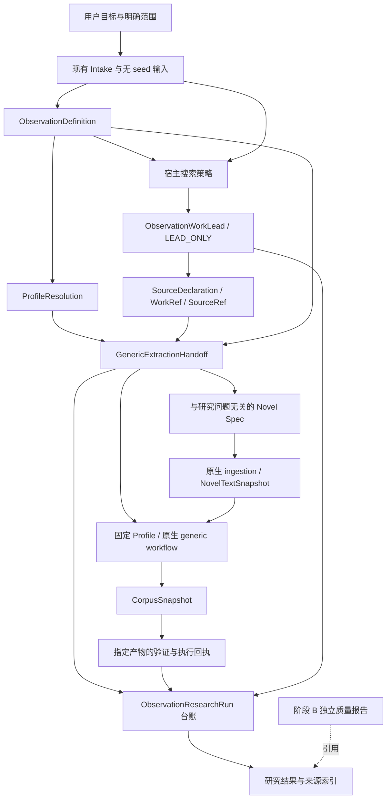

# 观察目标驱动的小说研究架构 v0.1

- 状态：**阶段 A 实施设计；契约、命令及宿主流程已进入实现，完整验收状态见构建方案。B/C 仍为设计。**
- 日期：2026-09-05。
- 实施集成基线：`3372edd47666175db9f6a17bee1b8446635ce355`；纳入其 standing attestation 更新，按用户决定保留 CI 移除。
- 核对代码基线：`eca4c7e41b99ec8966111ff11f2ced11c4d16eaf`。
- 产品目标：用户输入想观察的内容，宿主 Agent 自动规划、寻找作品与合格来源，通过原生全文抽取形成带原文依据的研究交付。
- 范围：局部观察抽取、研究交接、执行恢复和结果交付。跨窗口实体解析、事件链构建、机制归纳和游戏设计不在本方案范围。
- 构建顺序与验收见 [构建方案](OBSERVATION_RESEARCH_BUILD_PLAN.md)。

本文是在现有通用抽取实现之上增加研究入口的方案。它补充 [Generic Extraction A0.1](GENERIC_EXTRACTION_ARCHITECTURE.md)，不将该旧提案的所有设想宣布为已实现，也不替换现有 Scene 工作流的冻结契约。后续改变机器契约时，必须同步实现、架构说明和回归测试。

## 1. 产品承诺与当前实现

目标输出是：哪些作品被考虑、哪些来源被采用、执行了哪个固定 Profile、得到了哪些原文支持的局部观察、哪些作品未执行或执行未完成，以及当前有哪些质量证据。

“自动”指宿主 Agent 使用正式命令接续这些步骤。搜索不到合格来源、输入需要跨窗口分析、没有适用 Profile，都是可交付的明确结果；不能靠补全事实让流程显示成功。

| 原基线已实现 | 阶段 A 新增责任 |
| --- | --- |
| ResearchIntake、无 seed 的 NeutralPlanningInput、规划封存与重放 | 独立的观察定义及其与 Profile 的适配记录 |
| 宿主搜索、场景式 ResearchLead、来源声明与权限处理 | 不要求场景假设的作品相关性线索 |
| Scene Handoff 及其执行回执 | 平行的 Generic Handoff 与精确产物回执 |
| 通用全文单元、API / agent-files、证据校验、精确归约、缓存与重放 | 跨 Handoff 共用工作目录的执行互斥和研究级恢复 |
| 地理两种配置、种族和秘境配置；领域实验脚本 | 最小研究台账与宿主流程；后续统一质量报告及新 Profile 准入 |

架构可运行与语义质量合格分开。现有 ExtractionBuild、ExtractionRun、CorpusSnapshot 的未验证声明保持原义。

## 2. 总体结构与职责



箭头 H → E 表示选择并核对固定 Profile，不表示把 Handoff、研究目标或 Lead 文本注入抽取任务。搜索策略可以看到用户 seeds；观察定义和预算不得从搜索发现倒推。

| 层 | 拥有的责任 | 判断性质 |
| --- | --- | --- |
| 宿主研究工作流 | 理解目标、局部性判断、Profile 适配、搜索与选材、回答原生任务 | 语义判断或宿主声明，可记录与审查 |
| 研究契约与确定性命令 | 封存、引用检查、身份、预算记录、交接构建、执行回执与台账重建 | 机器可验证的结构与来源闭合 |
| 原生 Evidence Compiler | 来源冻结、全文单元、任务、回答校验、原始尝试、精确归约和重放 | 重用当前生产实现 |
| 质量验证层，阶段 B | 独立样本与评分、限定范围的质量评价 | 经验性结论，不修改原始语料 |

Profile 声明观察契约，语义执行器产生观察，core 校验证据完整性与来源。字段有合法引用不等于解释正确。宿主的 `COVERED` 或局部性判断也不因封存而成为机器证明。

## 3. 研究意图与 Profile 解析

### 3.1 ObservationDefinition：独立于实现的需求

阶段 A 新增独立记录，包含：

- 原始 intake 的外层引用、neutral input 的 artifact / ID，以及调用方提供的封存时间。
- 研究问题、纳入与排除规则、必要的区分和信息要求。
- 每项要求的稳定 `requirement_id`，由 builder 生成；适配表引用 ID，不以自由文本模糊匹配。
- 局部性判断：`UNIT_LOCAL`、`MIXED_REQUIRES_DECOMPOSITION`、`REQUIRES_CROSS_UNIT_ANALYSIS`。
- 判断理由、尚未覆盖的需求、作者与上下文隔离声明、记录 ID / hash。

独立中立 worker 的完整输入由现有 NeutralPlanningInput 投影而来，不接收 intake 原文、seed、已有哪些 Profile、搜索结果或章节提示。intake 对应关系由外层 builder 追加。隔离只能使用诚实的宿主声明；现有 NeutralPlanningExecution 只证明其绑定的 frame，不能冒充对新 definition 的声明。新记录必须绑定自己的实际输入 artifact 和隔离状态，不能自称 `PROVEN`。

需求可以来源于现有明确授权的范围；不能把推测写成用户已确认。缺少不可推断的范围时，由宿主补齐真实输入。旧 Phase −1 的确认来源语义不变。

局部性为 MIXED 时，必须封存新版本，列出可抽取部分与未解决部分，再产生执行解析；不能悄悄删掉跨窗口需求并宣称回答了完整问题。需要跨窗口分析的部分只进入报告的未覆盖项。

记录粒度以“窗口内可独立成立并保留必要关系”为准。类型相关的信息要求按适用观察类别表达，不能要求每种记录都填满同一套字段。规则陈述、实际事件、计划、传闻和推测必须按研究需求明确区分。

### 3.2 ProfileResolution：需求到固定配置的映射

新增记录引用完整 ObservationDefinition，按 decision 区分严格分支。REUSE_EXISTING 必须绑定选定 Profile 的 ref、ID、版本、package hash、extraction hash 和 reduction hash；CREATE_REQUIRED / UNSUPPORTED_BY_LOCAL_EXTRACTION 不携带可执行选择，必须列出未满足要求与原因。已检查但未采用的候选配置可以在 rationale 中说明，不构成可执行绑定。

逐项映射包含 requirement ID、`COVERED / PARTIAL / UNSUPPORTED / UNKNOWN`、相关 payload kinds / paths / prompt 规则及理由。机器验证要求引用完整、无悬空项、无重复冲突项、配置 hash 匹配；哪些语义被覆盖仍由宿主评估。

决策采用严格分支：

| decision | 阶段 A 行为 |
| --- | --- |
| REUSE_EXISTING | 必要局部需求均被声明覆盖，且已完成配置准入，才可准备 Handoff |
| CREATE_REQUIRED | 记录无匹配项；阶段 A 不临时造配置继续运行，阶段 C 接续 |
| UNSUPPORTED_BY_LOCAL_EXTRACTION | 交付未解决需求，不能执行为完整答案 |

适配另记录 `EXACT / SUPERSET`。已有 Profile 可能覆盖目标并产生更多记录，交付需说明范围；阶段 A 交付完整原生语料，不增加未经设计的模型过滤或语义裁剪步骤。

结构可加载、目标适配和经验质量是三个独立维度。阶段 A 可使用“已审查可执行、经验质量未验证”的内置配置。ProfileResolution 不改写 Profile，也不为迁就配置反向改写需求。

### 3.3 与现有规划的接合

复用现有 intake、无 seed 投影、封存/ArtifactStore/身份工具。通用分支不要求生成虚假的互动场景预算或 `min_interaction_families`。现有 Scene 规划记录和命令保持原语义。

通用研究的冻结计划置于 ObservationResearchRun 初始记录：引用 definition、规划 provenance、用户 seeds、宿主搜索策略及预算。由中立阶段决定预算，seed-aware 策略只能决定如何使用它。新通用路径有自己的重放检查，不伪称已通过只接受 Scene Handoff 的 `validate-planning-handoff`。

## 4. 开放搜索与来源准入

新增平行的 ObservationWorkLead，包含作品身份声明、与 definition 的相关性假设、实际搜索来源及其 locators、可选定位提示和 `LEAD_ONLY / UNVERIFIED_LEAD` 标记。不要求 `scene_hint` 或 `interaction_tags`。

只有解析出符合现有区分式身份基础的 WorkRef，才能形成可执行来源。未解析的作品仍以 Lead ID 留在台账；不能凭标题哈希制造确定身份。多个相容线索确定性分组；不相容来源或身份保留独立处置。

来源适配、SourceDeclaration、operator attestation、WorkRef 和 SourceRef 的生产原语优先复用。SourceRef 继续只标识来源/适配器配置，不加入观察定义、权限、质量、Profile 或模型。

技术可达性、使用权限和来源质量分别检查。沿用已有效声明的 standing attestation，不能推测或自行授予权限；完整来源的 edition status 为 UNKNOWN 并不自动拒绝。来源不足、明确禁止或权利不明均记入台账。

搜索提示不进入原文 spec、Profile、抽取任务或质量 gold。已有 Profile 的选择只依赖冻结需求和配置内容。若看过语料后修订需求/Profile，产生新版本与新评估记录，不能覆盖旧定义或混合前后结果。

## 5. Generic Handoff 与来源身份

### 5.1 独立契约，重用已有生产原语

新增 GenericExtractionHandoff、构建请求和 GenericExtractionExecutionReceipt。它们与 Scene Handoff 平行，避免给一个对象添加两组互不相交的 nullable 字段。

新 builder 负责读取和验证 CAS 引用、ProfileResolution、Lead 分组和 SourceDeclaration，构建 ordinary Novel Spec，再封存 Handoff。Handoff 是确定性 builder 输出，宿主只写草案和调用命令。

输入/产物均通过对应 ArtifactStore 读取并校验内容；工作目录的可见 JSON 是便于操作的副本，不因文件名看起来像 hash 而可信。新研究对象不进入 core Catalog。

### 5.2 与研究问题无关的 ingestion spec

新 Generic 准入边界仅允许：

```text
source
rights
source_quality
limits
strict_order
```

显式填入约定默认值、规范化来源表示并解析本地路径后，再封存和计算 whole-spec hash。禁止 request/discovery_brief、scene_scout、Profile、模型配置、definition 和 Lead 信息。来源适配器的合法原有参数仍留在 source 内；限制越界应失败，不能默默缩成章节抽样。

增加独立的 generic preflight 组合，复用 source/rights/quality/limits 原语。不能用占位 discovery brief 绕过现有 EVIDENCE_HANDOFF 的 Scene 检查；也不改变 direct Scene 调用的默认值、错误顺序和副作用。

prepare/execute 的来源可访问性检查与完成产物的离线验证分开。重放已完成回执时使用冻结 spec/CAS 和原生 lineage 校验，不要求原始 TXT 或网页仍然存在；这不削弱新执行和续跑时的来源变化检测。

```text
Handoff.expected_input_spec_hash
  == hash(路径解析后的整个 generic Novel Spec)
  == NovelIngestionRun.input_spec_hash
```

改变权限、来源质量或 ingestion limits 会改变 whole-spec 身份，这是预期行为；不能为了缓存忽略这些事实。与研究问题无关不等于与来源治理无关。

### 5.3 Handoff 的最小绑定

- definition、resolution、相关 WorkLead、SourceDeclaration 的 artifact / ID / hash。
- WorkRef、SourceRef；定位信息仅允许 Lead/hint 索引引用。
- projected spec 的 artifact、可定位副本及 expected whole-spec hash。
- 固定 Profile 的 package / extraction / reduction 身份。
- builder 的实现/契约版本与内容身份、可重放的构建请求和时间。
- `execution_scope = FULL_WORK`、`contains_evidence = false`；准备成功仅表示有资格尝试执行。

definition/resolution 不进入 ingestion、NovelTextSnapshot、ExtractionBuild、ExtractionUnit 或模型请求。Handoff 可以改变而复用同一份原生抽取结果。

## 6. 执行、复用与身份变化

原生执行仍调用 `run_generic_corpus_workflow`。新包装层只负责准入、执行尝试、资源互斥、恢复和回执，不自行实现窗口、prompt、回答修复、重试链、归约或语料生成。

### 6.1 复用的明确条件

阶段 A 使用显式工作目录绑定：宿主通过研究台账找到已记录的 source/spec 工作目录，原生校验成功后复用。初版单个研究执行一个 Profile，多个作品顺序调度；窗口内部并发沿用原生运行时。

不提供全局自动缓存发现或跨目录语料迁移。改变问题但复用同一已冻结 snapshot、实际执行配置和固定构建时，可以避免重复语义调用。新工作目录重新 ingestion 不保证得到同一 snapshot；原生 ingestion 含来源和运行 lineage。

| 变化 | 当前身份规则与拟定交接行为 |
| --- | --- |
| 仅研究问题、definition、Lead 或搜索策略变更 | 研究/交接身份可变；不注入原生执行身份 |
| source、rights、source_quality、limits、strict_order 变更 | spec/ingestion/snapshot 绑定变化；同一旧目录的身份冲突应拒绝 |
| 包内已绑定文件字节变化 | package hash 变化；旧 Handoff 在执行前拒绝配置漂移 |
| 抽取 prompt/schema/执行参数等抽取相关输入变化 | 按现有 extraction identity 规则创建新构建 |
| 仅 reduction 配置变化，且 runtime commit 等抽取身份相同 | 可复用 ExtractionRun，创建新 ReductionRun/CorpusSnapshot |
| repository commit 或受绑定引擎实现变化 | 当前 ExtractionBuild 身份变化；不承诺跨 commit 复用 |

特别是，“修改归约配置后又提交了新 commit”可能同时改变抽取构建。不能为了归约复用而删除现有 repository_commit 绑定。旧构建重放需要匹配的 runtime；后续跨版本复用属于独立设计。

### 6.2 工作目录互斥

目前原生 ingestion 的锁只覆盖 ingestion；不同 Handoff 共用目录可能在 generic checkpoint/reduction 阶段冲突。阶段 A 需要一个原生 generic work-dir 级进程锁，覆盖整个 `run_generic_corpus_workflow`。公开的 `run_generic_extraction`、`run_generic_reduction` 独立调用也必须取得该锁，直接 CLI 和 Handoff 使用同一保护边界。

锁顺序固定为：外层 Handoff → generic work-dir → 原有 ingestion 锁。公开入口取得锁，内部复用明确的已持锁实现，避免嵌套重复加锁。Handoff 保持 generic 锁直到指定产物验证和终态回执发布完成；正常 WAITING/PARTIAL 返回后释放，宿主可以回答原生任务。独立目录可以并行，共享目录冲突明确拒绝/报告，不增加后台排队、lease 或调度器。

campaign 执行时的完整锁顺序为 campaign → Handoff → generic work-dir → ingestion。campaign 在读取 native predecessor 前取得 Handoff 锁，直到 native return 登记为 campaign finish 后才释放；native wrapper 仅复用同进程、同线程、同目录且仍存活的显式 token。executor 配置/descriptor 解析不创建任务目录，agent-files 的 materialization 在 reservation 发布及 native 锁取得后发生，其 OSError 记为 FAILED_PRESTART。

## 7. 尝试状态机与回执

准备状态、执行状态、记录数量、语义质量分开表达。拟定执行状态：

| 状态 | 含义与后续 |
| --- | --- |
| STARTED | 已固定 attempt 的 spec、Profile、实际 executor 配置与可得的 build 身份，准备调用原生路径 |
| WAITING_FOR_AGENT | 原生任务未全部回答；保留 pending 与已有失败信息，可以续跑同一 attempt |
| PARTIAL_RETRYABLE | 原生 GenericExtractionPartial 且恢复绑定合法；checkpoint 和失败项保留，允许同一 attempt 续跑 |
| INTERRUPTED | 最近一次 invocation 有开始标记，却没有匹配的 WAITING/PARTIAL/终态返回事件，且可重新取得执行锁；按原生状态核验后明确处置 |
| SUCCEEDED | 指定原生产物验证通过，生成不可变回执 |
| FAILED | 非可恢复异常、身份/产物错误或外层验证失败；记录错误阶段与代码，不能自动视为 PARTIAL |

`GenericAgentResponsesPending` 当前优先于已记录单元失败；WAITING 不表示 failed count 为零。状态汇总必须同时保留两类情况。原生 partial 是可保留进度的状态，不承诺无需外部修复就会成功。

每次进入原生流程前核对 executor 的 kind、build ID、model/label、endpoint、response format、timeout、attempt 参数及实际 ExtractionBuild；不能只比较 `--executor` 字符串。调用结束前再次核对实际构建。运行中的 Profile/源/runtime 漂移拒绝续跑，旧审计链保留。

agent-files 的 model label 是宿主声明，不是管线对后台实际模型版本的证明。记录可获得的宿主执行信息并如实限定评估范围，不能从标签相同推出语义执行完全相同。

每一次初始调用或续跑都先追加唯一 invocation-start 标记，再匹配一次 invocation-return，不能靠历史上出现过 WAITING 就推断当前仍在正常等待。中断恢复先核验同一 spec、profile/runtime/executor、工作目录、checkpoint 与原生任务链；全部匹配才追加明确的恢复决定和新 invocation-start，继续该 attempt。失败后的新 attempt 也不授权忽略 checkpoint 身份。重试/恢复次数受预先声明预算约束。

PR #17 审查修复将 GenericHandoffAttemptEvent 和 ObservationResearchEvent 升为 v2。native STARTED 的 `detail.campaign_start_artifact_id` 必须存在：direct 调用为 null，campaign 调用引用已发布 reservation 的 CAS 内容哈希。native 校验该 reservation 的 journal 字节、handoff、predecessor、目录、recovery 和完整 executor descriptor；campaign 只接受明确属于自己的 native start/return。该字段不进入原生模型任务或 ExtractionBuild。

相邻 STARTED 和相同 executor 不能证明归属。若 reservation 后、native start 前进程中断，随后 direct caller 执行，恢复将记录 FAILED_PRESTART / E-OBSERVATION-EXTERNAL-INVOCATION，不认领其结果；后续未登记 native continuation 仍被拒绝。保留原 campaign 审计记录，外部执行按其原生路径处置；新 campaign 可显式复用已验证成功回执。若没有外部调用，明确恢复可预留新的 full-work attempt。若是自己的 native return 已发布但 campaign finish 丢失，则只补该 finish，不再扣预算。

campaign reservation v2 冻结 `recovery`。执行与回放复用 `plan_generic_invocation`：WAITING/PARTIAL 的正常续跑及 STARTED + resume 消耗 resume 预算；FAILED/STARTED + retry 增加 attempt ordinal，消耗 full-work 预算。此前 FAILED_PRESTART 后的新预留也消耗 full-work 预算。互斥参数和非法 recovery 状态在新预留前拒绝。

journal 只枚举已发布的 `*.json`；writer 在同目录产生的临时文件和 OS 元数据不是事件，进程被杀后无需删除它们即可验证/恢复。正式 JSON 仍要求连续序号、普通文件、非 symlink、canonical bytes、CAS 和哈希链闭合。v1 journal 不会自动升级或被推定有 ownership；旧产物保留原运行时验证，新运行使用 v2。

事件和终态回执不可变，记录单调序号和前序内容引用。checkpoint 的路径只用于定位；如冻结其某次状态，必须复制到 CAS 并绑定 hash，不能将可变路径当作历史证据。完整性错误继续失败关闭。

成功回执至少精确绑定：spec hash、ingestion ID、text snapshot ID/hash、extraction build/run ID/hash、reduction run ID/hash、CorpusSnapshot ID/hash、Profile 身份、执行 attempt 和指定验证结果。

新增“验证指定 corpus”的组合函数，复用现有 generic 校验原语。当前 `validate_generic_work_dir` 可返回多个合法归约结果，单个 PASS 不能证明回执对应哪个产物。新进程应能从 Handoff/CAS 和指定运行重建至该回执的唯一目标；不要求整个目录只有一个 CorpusSnapshot。

## 8. 研究台账与可读交付

ObservationResearchRun 放在宿主研究目录，保持在 Catalog 外。采用不可变初始计划、顺序事件、可重建的当前视图和冻结最终报告。它记录研究事实，不发任务、不维护 worker 状态，也不成为第二个证据数据库。

初始计划绑定 definition、resolution、策略/规划 provenance、输入来源与独立预算。旧 Phase −1 的 `target_leads` 不能等同于作品数或全文执行次数；新增预算明确区分 search rounds、source attempts、full-work attempts、resume invocations 和 target works。

每次研究执行 invocation、搜索或来源尝试前由宿主登记计划操作，之后补实际工具/回执引用。单元级模型调用和重试仍由原生 ModelAttempt/checkpoint 记录，不增加第二套 per-unit 台账。工具使用的完整性仍是宿主审计声明；文件台账不能证明宿主未在台账外搜索。原生命令侧可对已记录的执行预算做确定性限制。

每条作品记录可包含多个 Lead、多个来源尝试和多个执行 attempt，不能只留最后一次成功。至少区分：

- discovery：LEAD_ONLY / IDENTITY_RESOLVED。
- source：UNRESOLVED / BLOCKED_BY_RIGHTS / INELIGIBLE_QUALITY / ELIGIBLE。
- execution：NOT_STARTED / HANDOFF_READY / 上述执行状态。
- result：实际 corpus 引用与 record count；零记录属于 SUCCEEDED。
- quality：未评估或引用匹配范围的独立报告；不改写原生 assurance。

final report 由已记录事件与验证过的回执重建，逐一处置所有线索/作品/来源尝试。报告包含候选与执行分母、停止原因、未知项、失败项、零结果，以及完整语料的 artifact/章节/segment/offset 索引。跨作品只做分组与呈现，不做实体合并或规则归纳。

报告 v2 的 `source_statuses` 保留每次来源尝试的不同处置；`execution_statuses` 取每个 handoff 的最新状态，未执行的合格 handoff 为 HANDOFF_READY；`execution_history_statuses` 另存历史 invocation 状态。兼容的摘要列在多个状态并存时显示 MIXED，不以最后一条覆盖其他 handoff。works 按自身 handoff 关联执行，不从共享 lead 的摘要反推。完整 attempts、invocations、失败计数和 corpus 引用继续保留。

SOURCE 不合格时报告无法执行；未发现目标只报告“本次抽取零观察”，不能宣称原文不存在或全书召回完整。Profile 为 SUPERSET 时明确展示原生输出的更广范围。原文摘录分发继续遵守 may_export_excerpts；权限不足时交付允许的索引和状态，不通过报告复制受限原文。

停止原因采用有界类别，例如目标数量达到、搜索预算耗尽、来源尝试耗尽、执行/恢复预算耗尽、没有可用 Profile、需补输入、用户停止。指标或结果好坏不用于悄悄改变预算；变更预算需新计划修订并保留旧记录。

## 9. 质量报告与新配置：阶段 B / C

阶段 A 可以使用已审查的内置 Profile 执行，但不产生“质量已合格”结论。阶段 B 建立独立 QualificationReport，绑定评价对象、冻结样本、独立 gold、scorer、实际运行、阈值、范围和限制。

单元抽取质量绑定 ExtractionBuild；语料归约后指标还绑定 reduction identity 和 CorpusSnapshot。准确率、召回率、字段/关系错误、证据支持和容量指标按研究需要选择；原文引用合法只是其中一个维度。标注分歧保留，模型看不到 gold；held-out 不能作为反复调参材料。覆盖范围不能由小样本外推到所有小说。

现有产物仍是 UNQUALIFIED / UNMEASURED。交付可同时引用限定范围的质量报告；报告不回写或篡改历史产物。不匹配的模型、Profile、运行时或归约版本不能沿用原有资格。

阶段 C 才处理 CREATE_REQUIRED：宿主在分支形成 Profile 草案，做结构/证据策略检查、正反 fixture 与约定审查，纳入受信任仓库资产后重新生成 ProfileResolution，再通过 A 执行、B 评估。提交动作本身不是信任证明；审查可以由人或已明确授权的代码审查流程承担。

只增加受限的 prompt/schema/manifest 配置，不开放任意代码、远程配置、动态 reducer 或运行时绕过准入。对新主题能自动准备实验，不承诺自动生成即高质量。

## 10. 实施边界与设计决策

阶段 A 拟用的模块：observation_planning、generic_handoff、generic_handoff_execution、observation_campaign，原生命令薄适配进入现有 CLI。实际拆分以职责和代码规模为准；禁止为每个记录新建运行时服务。

新增 schema 默认放现有 contracts 根目录以复用分发规则。ID/hash 均由确定性 builder 生成，不由宿主手写；研究对象不加入 Catalog.ID_FIELDS。通用 schema 交叉引用、边界与状态转换在实现前冻结，本文字段列表不是可直接执行的完整 JSON Schema。

不修改已有 Scene records 为双路径 nullable 对象。复用来源/权限/身份/文件工具；仅在新旧路径有同一生产责任时抽取小型共享原语，保持旧错误语义。原生 generic work-dir 锁和指定 corpus 验证属于必要的运行时补强。

保留的限制包括：不实现 Analyzer、跨书知识库、全局缓存服务、搜索引擎、商业小说站浏览器自动化、worker scheduler、动态 Profile 插件市场或自动游戏规则生成。

## 11. 当前代码依据

- [通用任务构造与运行](../src/xhnovel_pipeline/generic_extraction.py)：_task_input、build_extraction_build、run_generic_extraction、validate_generic_work_dir。
- [Profile 身份](../src/xhnovel_pipeline/generic_profile.py)：package / extraction / reduction 的分离。
- [归约复用回归](../tests/test_generic_extraction.py)：test_reducer_only_profile_change_does_not_call_model；同固定 runtime 条件下复用抽取。
- [Novel Spec](../src/xhnovel_pipeline/novel_spec.py) 与 [ingestion](../src/xhnovel_pipeline/novel_ingest.py)：现有 Scene preflight 与 whole loaded spec 身份。
- [Scene Handoff](../src/xhnovel_pipeline/phase0_execution.py) 与 [回执契约](../contracts/evidence-handoff-execution-receipt.schema.json)：当前场景式执行绑定。
- [generic agent-files](../src/xhnovel_pipeline/generic_agent_files.py)、[generic CLI](../src/xhnovel_pipeline/generic_cli.py)：现有原生任务与状态出口。
- [CorpusSnapshot 契约](../contracts/generic/corpus-snapshot.schema.json)：固定的质量与完整性声明。
